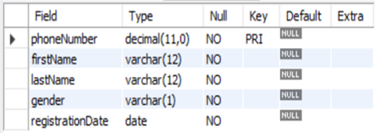

# Computer Store Management System

## Overview

The **Computer Store Management System (CSMS)** is a Python-based project designed to automate the process of ordering computer parts like processors, graphics cards, and RAM from a store. This system simplifies the order process for customers, stores the data in a MySQL database, and allows an admin to manage orders and users.

---

## Features

- **User Registration**: Customers can register by providing their details, including phone number, name, gender, and registration date.
- **Order Placement**: Customers can build their own PCs by choosing from available processors, graphics cards, and RAM, and place their orders.
- **Admin Portal**: An admin can log in to a password-protected portal to manage:
  - View current orders.
  - View customer details.
  - Delete specific orders.
- **MySQL Database**: Data is stored in MySQL tables (`Customers` and `Orders`).

---

## Installation

1. **Clone the repository**:
    ```bash
    git clone https://github.com/yourusername/computer-store-management.git
    cd computer-store-management
    ```

2. **Install MySQL Connector for Python**:
    ```bash
    pip install mysql-connector-python
    ```

3. **Set up MySQL Database**:
    - Create a new database:
      ```sql
      CREATE DATABASE mydb;
      ```
    - Execute the SQL commands to create necessary tables (`Customers` and `Orders`):
      ```sql
      CREATE TABLE IF NOT EXISTS Customers (
          phoneNumber DECIMAL(11) NOT NULL PRIMARY KEY,
          firstName VARCHAR(12) NOT NULL,
          lastName VARCHAR(12) NOT NULL,
          gender VARCHAR(1) NOT NULL,
          registrationDate DATE NOT NULL
      );

      CREATE TABLE IF NOT EXISTS Orders (
          phoneNumber DECIMAL(11),
          processor VARCHAR(25),
          gpu VARCHAR(18),
          ram VARCHAR(18),
          address VARCHAR(40),
          orderDate DATE NOT NULL,
          FOREIGN KEY (phoneNumber) REFERENCES Customers(phoneNumber)
      );
      ```

---

## Usage

1. **Run the program**:
    ```bash
    python computer_store.py
    ```

2. **Login or Register**:
    - If you are a new user, select to register and provide your details.
    - Existing users can log in using their phone number.

3. **Main Menu**:
    - **Option 1**: Build a PC and place an order.
    - **Option 2**: View your orders.
    - **Option 3**: Access the admin portal (requires password).
    - **Option 4**: Exit.

4. **Admin Portal**:
    - The admin can manage orders, delete orders, and view users' details using a password (`pc123`).

---

## Code Structure

- **register()**: Registers a new customer in the `Customers` table.
- **order()**: Allows the customer to place an order by selecting a processor, graphics card, and RAM.
- **admin_portal()**: Admin portal for managing orders and users.
- **main()**: The main interface for the user to interact with the system.

---

## Screenshots

- **Customer Details Schema**:  
  

- **Orders Schema**:  
  

- **Sample Customer Data**:  
  

- **Sample Order Data**:  
  

- **Admin Delete Order**:  
  

- **Admin Print Orders**:  
  

- **Admin Print Users**:  
  

- **Exit Screen**:  
  

- **Login Screen**:  
  

- **Place Order Screen**:  
  

- **Registration Screen**:  
  

- **View Order Screen**:  
  

---

## Bibliography

- [Generatedata.com](https://generatedata.com)
- [Stack Overflow](https://stackoverflow.com)
